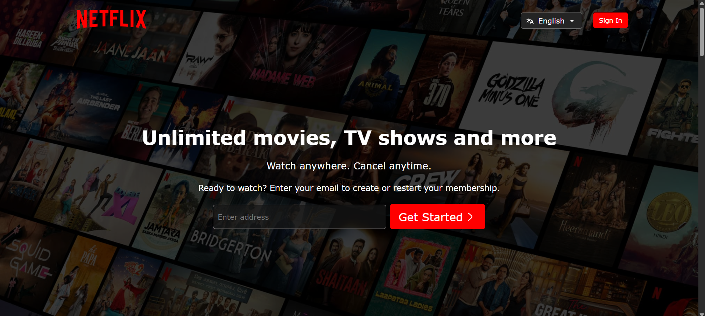
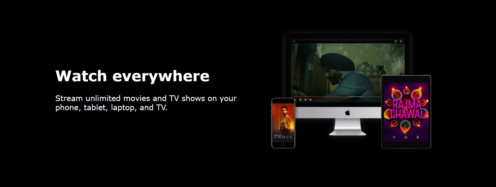
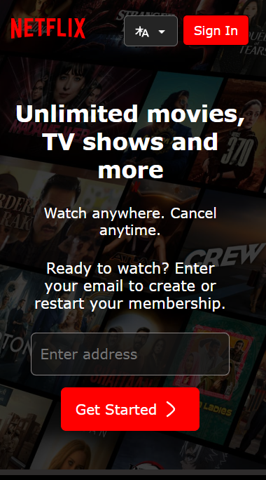
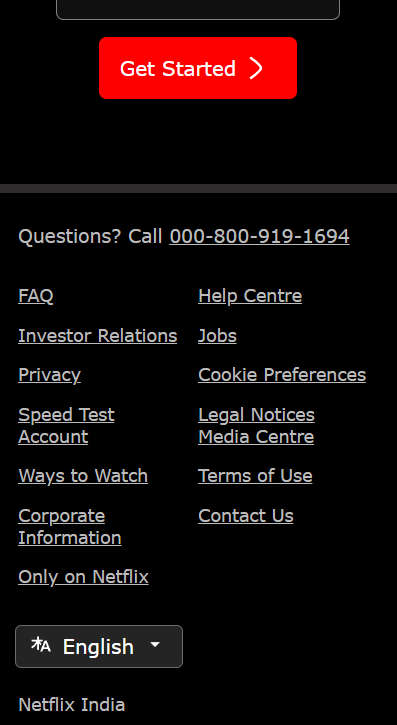

# 🎬 Netflix Clone (HTML + CSS Only)

This is a **responsive front-end clone** of the Netflix landing page built using **pure HTML and CSS**. The design mimics the look and feel of the original Netflix homepage, adapted for both **desktop and mobile devices**. This project was created for educational purposes and focuses on layout, responsiveness, and clean code.

---

## 🌐 Live Preview

👉 [Click to view live](https://netflix-clone-flax-seven-30.vercel.app/)

---

## 📸 Screenshots

### 💻 Desktop View

  

### 📱 Mobile View
 &nbsp;&nbsp;

> 💡 All screenshots are stored in the `/screenshots` folder inside the repository.

---

## 🚀 Features

- ✅ Fully responsive layout using Flexbox
- ✅ Clean and structured HTML5
- ✅ Netflix-style UI with hero banner and CTA
- ✅ Mobile-first design approach
- ❌ No JavaScript used — purely static

---

## 🛠️ Tech Stack

- HTML5
- CSS3
- Media Queries (Responsive Design)

---

## 📁 Folder Structure

---

## 📌 Disclaimer

This project is a **static front-end clone** built only for **educational purposes**. All trademarks, logos, and branding belong to Netflix.

---

## ✨ Author

- Sarwesh  
- 🌐 Portfolio (Coming Soon)  
- 🛠️ Freelance Web Developer

